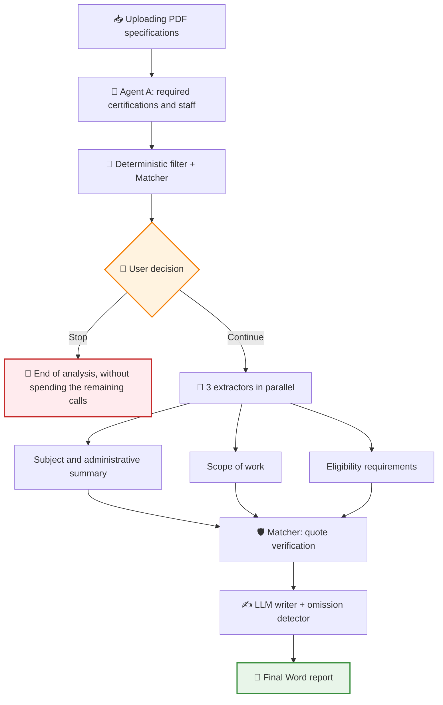
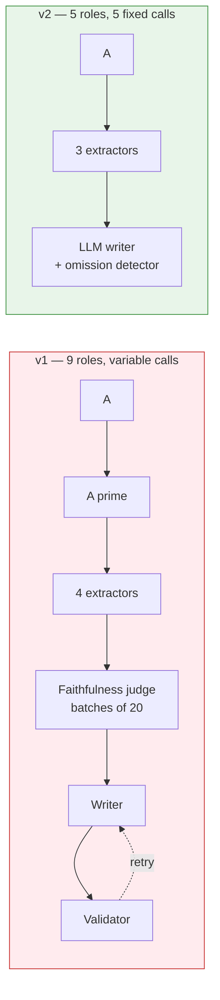
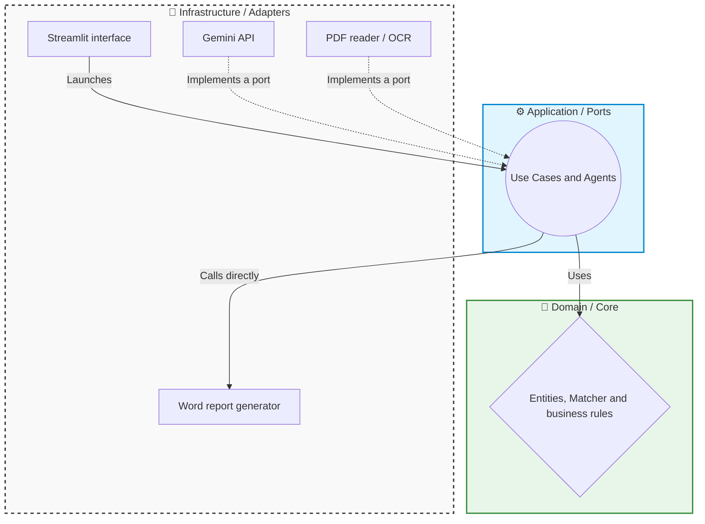

# 🤖 Showcase: AI Tender Analyzer

This project is a tool designed to automate the reading and extraction of requirements from public tender documents (such as the PCAP or PPT specifications). It uses a team of Artificial Intelligence agents to find the conditions a company must meet in order to bid in a public tender, and generates a final Word report with the verified results.

> [!NOTE]
> **Confidentiality Notice**
> Since this project was developed for a company, certain internal details, specific prompts and parts of the code are protected by confidentiality. However, in this document I explain in broad terms the main structure and how the application works.

## 🔎 What does the application do?

The application receives documents in PDF format and uses AI models (currently Google Gemini) to find "facts" or eligibility requirements (for example, required certifications such as ISO 27001 or the ENS, mandatory staff profiles, data protection regulations, etc.).

One of the biggest challenges when using AI is preventing it from making up information (what is known as "hallucinations"). To solve this, the system backs every fact with verifiable evidence:

- 🎯 The AI is required to return the **exact verbatim quote** from the document where it found the requirement, together with its page number.
- 🛡️ An internal verification module (**Matcher**) checks deterministically —with no AI and at no cost— that this text really exists in the pages of the original PDF. Whatever is not found does not make it into the report.
- 👤 Each fact in the final report carries its document and its page, so that the person reading it can open the specification and check it in seconds. **Human review is part of the design, not a patch.**

## 🔄 Workflow

The analysis is done in two stages, with a human checkpoint in between:

**Agent A** acts as a gate: it looks for certifications and standards (ISO, UNE, ENS) —both those required to bid and those that earn points or that the winning bidder must comply with during execution, including the ENS level— and the staff the specification requires to be assigned. With that summary —each requirement with its quote and its page— the user decides whether it is worth continuing. If they stop there, not a single additional call is spent.

That human "gate" is not a quality check on the agent: **it is a business decision**. The system informs, it does not give an opinion on whether to bid — the person, not the model, is the one who knows which certifications their company holds.

## ✂️ v2 redesign: fewer agents, fewer calls

The first version of the system had **nine AI roles**: the exclusion agent, a "devil's advocate", four extractors, a faithfulness judge, a writer and a final validator. On paper it was a defensive architecture. In practice it had two problems.

**Problem 1: the most expensive machinery did not cover the most serious risk.** The faithfulness judge and the validator checked that every claim had a quote behind it — they protected against fabrication. But the real risk of this tool is not that it makes up a requirement: it is that it **leaves one out**. And an omission does not generate any claim to judge, so those two agents were blind precisely to the failure that matters most. Besides, quote verification was already being done by the deterministic Matcher, for free.

**Problem 2: the cost grew with the document.** The faithfulness judge processed facts in batches of 20, so a dense specification made the calls skyrocket. A real case from the *golden set* generated **74 facts in a single extractor**: that is four more judge calls just for that agent.

| | v1 | v2 |
|---|---|---|
| AI roles | 9 | **5** (A, 3 extractors, writer) |
| Calls per analysis | ~10 to 18, **depending on the density of the specification** | **5, fixed** |
| Word generation | Uncontrolled LLM writer | LLM writer + **deterministic detector of omitted facts** |

> [!IMPORTANT]
> As of 15/09/2026 the cut is applied in the code: the four retired agents are **deleted from the repository**, not disconnected. How the report is generated is still an open decision (see *A reverted decision*).

The important thing is not only that there are fewer calls: it is that they are now **a constant number**. In v1, analyzing a long specification cost more calls than a short one, so the spending was impossible to predict before launching it.

### Why this matters so much: the free tier

The project runs on the **free tier of the Gemini API**, which limits requests per minute and per day. There, the scarce resource is not money — it is the **call quota**. With 9 roles and a variable number of requests, a single dense specification could consume a good part of the daily margin and leave the tool unusable for the rest of the day.

Going down to 5 fixed calls per analysis changes the nature of the limit: it goes from being an unpredictable risk to a trivial calculation. And since the 3 extractors run in parallel, the complete analysis is **three rounds of requests** (A, extractors, writer), not five sequential ones.

### What was removed, and why

| Retired piece | Reason |
|---|---|
| Faithfulness judge and validator (2 LLM agents) | They protect against fabrication, which the deterministic Matcher already covers for free. They do not detect omissions, which is the declared critical risk |
| "Devil's advocate" (looks for legal loopholes in an unmet requirement) | That judgment is better made by the person, who knows their own company. It moves to the decision screen |
| SLA/KPI/penalties extractor | That information is not needed in the report for now |

### A reverted decision: deterministic rendering

When running the complete pipeline on a real specification, I found that the writer received all the facts and wrote a report that left out the ENS certificate and the GDPR clauses. Nothing in the system detected it — the validators were built to catch what the model *makes up*, not what it *silently drops*. The initial v2 plan was to replace the writer with code.

While preparing that change, the real cause appeared: **the writer's prompt instructed it to ignore agent A's categories**. It was not omitting things by its own judgment; it was obeying.

With the prompt fixed, the writer stays, because the report is the product and prose reads better than a list. The omission is not considered solved: it is **measured**. Each report calculates, without any calls, which verified facts the writer received and did not cite, and shows them on screen. In a real run on the densest specification there were 67, so the comparison against a deterministic render remains open and will be decided with both Word documents side by side.

## 🔬 What the benchmarks taught

I designed my own *benchmarking* harness to choose the model for each agent, with *ground truth* taken from real reports and page-by-page comparison. These are the conclusions it produced, and none of them were obvious beforehand.

> [!NOTE]
> Lessons 1 to 7 come from the first version of the harness (August and the first half of September), measured on a *golden set* that was later replaced. They still explain current decisions, but their figures **are not comparable** with those of the current set. Lessons 8 to 10 come from the 18/09 measurement on the new set.

### 1. There is no "best model": there is the best model *for each agent*

This is the hypothesis I started with, and the data confirmed it in the most emphatic way possible — **the same model came first in one agent and was discarded in another**:

| Model | Extractor B1 (subject and summary) | Extractor B4 (eligibility requirements) |
|---|---|---|
| `gemini-2.5-flash` | **4/4 (100%)** — the best | ❌ **Discarded** |
| `gemini-3.6-flash` | 3/4 (75%) | **10/11 (91%)** — the best |
| `gemini-3-flash-preview` | 3/4 (75%) | 9/11 (82%) |
| `gemini-3.5-flash-lite` | 3/4 (75%) | 4/11 (36%) |

The last row is also interesting: the cheapest model goes from being competitive in one task (3/4) to useless in another (36%). Choosing a single "good" model for the whole system would have been the wrong decision, both in terms of quality and cost.

### 2. Reliability and accuracy are not the same thing — and reliability wins

`gemini-2.5-flash` got **6 out of 6** right in the tenders it managed to complete in B4. Even so, I discarded it for that agent. The reason: it did not finish its calls. It is an extremely granular model —up to 6× more output tokens than its rivals for the same document— and it exhausted the response limit halfway, returning a truncated JSON that cannot be parsed. **An agent that is right 100% of the times it finishes, but only finishes half the time, is unusable.**

Along the way, this uncovered a real configuration flaw: one specification in the *golden set* needed **12,982 output tokens** (74 facts) against the 8,192 limit shared by all the extractors. Without the benchmark, those facts would have been silently lost in production.

### 3. When several models fail the same thing, the problem is yours

In B1, three out of four models failed **exactly the same item**. A shared failure is not random noise: it is a design signal. On investigation, it turned out that the extractor's instruction said "do not extract operational data, that belongs to other agents" — and that scared off legitimate content that in many specifications lives under headings such as *"Descripción de los trabajos"* (Description of the work).

It was not a model problem, it was a **poorly drawn boundary between agents**. In v2 the extractors have been redefined following the real structure of the documents instead of semantic categories I had invented.

### 4. The first benchmark measures your *ground truth* as much as the model

Several templates from the Junta de Castilla y León include a summary sheet on page 1 that repeats the subject and the budget before developing them in prose several pages later. My *ground truth* only pointed to the prose, so it marked as failures models that **correctly** cited page 1.

In other words: for a while I was measuring incorrectly. The lesson I take away: the first results of a new test bench should be read as suspicious of the bench itself, not as verdicts on what it measures.

### 5. A newer model is not a better model

When testing a later-generation model on the same 66-page specification, it returned **209 output tokens and 1 requirement**, compared with the **2,589 tokens and 8 requirements** of the previous model. For the agent whose critical metric is not leaving anything out, being faster and cheaper does not make up for it: there, the assignment criterion is *recall* at almost any price.

### 6. Measure before fixing: the hypothesis was false

An extractor emitted 32,754 output tokens and got truncated. The suspicion was that it was duplicating quotes. A dump of 421 facts disproved it: only 2 identical quotes. The real cause was different: **95 of 166 facts were a list of laws broken down regulation by regulation**. When it was trimmed, the volume went down, but certifications such as the ENS were lost. The closing criterion ("narrowing cannot lower *recall*") was not met, and that led to moving the certifications to agent A with a deterministic filter.

### 7. Prompt and model are coupled

With the same instruction ("one fact per service block"), `gemini-2.5-flash` emitted 138 facts in that extractor and the 3.x models between 6 and 15. But the 3.x models lost budget, duration and security obligations in the other extractors. In addition, they count **the same PDF at twice the input tokens** (~35,300 versus ~17,500). With the free quota, the distribution of models is also a matter of availability, not just quality, and a prompt fine-tuned for one model has to be measured again when the model changes.

### 8. The best *ground truth* is the one the reviewer already produces

The original *golden set* consisted of hand-transcribed text files: they said what was in the specification, but did not record **what the reviewer had had to correct** in the AI's report, which is exactly what we want to measure. I replaced it with the Word reports the application itself generates, annotated by the reviewer with a color code:

| Mark | Meaning | Effect on the metric |
|---|---|---|
| 🔴 Red | The AI stated it and it is incorrect | Lowers precision |
| 🔵 Cyan | The AI omitted it and it was in the specification | Lowers *recall* |
| 🟡 Yellow | Essentially correct, with a detail corrected (or in the wrong section) | Quality, not a hard failure |
| 🟣 Pink | It was not in the specification: the AI could not have known it | **Out of the denominator** |
| No mark | Correct | ✓ |

A script reads the Word documents live and derives the *ground truth* for each extractor from them: **239 entries across 9 specifications**, without transcribing anything. Annotating means marking exceptions, not confirming hits, so the set grows with the work the person already does.

The pink mark exists because of a real case: a 65-page specification **did not contain any amount figure**. Marking it as an omission would have penalized the extractor for something that was not in its input. And the known limit is written down: the denominator is *what a human saw*; a fact that neither the AI nor the reviewer missed does not show up anywhere.

### 9. An upper bound is for ruling out, not for giving a figure

Measuring "did the model extract this fact?" requires judging whether a paraphrase is equivalent to the original. The harness does the cheap part first: it counts as a *candidate* any fact on the exact page. That is an **upper bound**, and the human verdict puts it in its place. On the 27 🔵 omissions of the scope extractor that all models were able to measure:

| Model | Upper bound | Human verdict (correct fact + page) |
|---|---|---|
| `gemini-3.6-flash` | 24/27 | **18/27 (67%)** |
| `gemini-3-flash-preview` | 14/27 | **7/27 (26%)** |

Three conclusions: the bound inflates both by a similar amount (6-7 entries), so it ranks well but does not measure; the advantage of `3.6-flash` **survives the verdict** (more than double); and `gemini-3.1-flash-lite` (43% upper bound on total *recall*) is ruled out without needing a manual review. In addition, **8 of the 27 omissions are not recovered by any model**: there the problem is not the model, it is the prompt, which asked for "one fact per service block" and squashed task lists into a single one.

A detail I consider as important as the figures: in the first pass I marked as a failure a correct answer from `3.6-flash` ("Digital twin and advanced simulation platform" versus "Digital twin and advanced simulation"). **Human review also makes mistakes**, and that is why the verdict is stored in a reviewable sheet, not just as a number.

### 10. "The new model doesn't work" was a default value

For days, any model other than `gemini-2.5-flash` made the run fail. The cause was not the model: the adapter requested a minimum reasoning budget of 1 token from models without their own configuration, each model raised it to its internal minimum, and **the reasoning ate up the agent's output ceiling**. Giving those models an explicit budget of 0 was enough to make them work, and it was what unblocked the comparative benchmark. What is pending is noted down: checking in the reasoning token counter that it is really turned off, and not just that it no longer gets in the way.

## 🏗️ Project Architecture

I developed this project applying the **Hexagonal Architecture** pattern (also known as Ports and Adapters). This design decision has allowed me to clearly separate the business logic from external technologies.

The project is divided into three main layers:

1. 🧠 **Domain (`core/domain`)**: This is where the core rules of the project live. For example, the basic entities (Document, Fact) and the pure text verification logic. This layer knows nothing about databases or external APIs.
2. ⚙️ **Application (`core/application`)**: It coordinates the workflows. Here I define the "Ports" (interfaces) that establish how any language model or auditing system we may want to use in the future must behave, and this is also where the agents that orchestrate each phase live.
3. 🔌 **Infrastructure (`infrastructure`)**: This is where the "Adapters" live, which are the real technology implementations. For example, the code that makes the requests to the Gemini API, the one that extracts text from PDFs, the Word report generator or the Streamlit user interface.

This separation is what made the v2 cut possible: **retiring four agents did not require touching the PDF reader, the Gemini adapter or the interface**. The use case that orchestrates them changed, and little else.

> [!NOTE]
> **Known debt (15/09/2026).** The separation is not perfect yet: the domain Matcher reads its thresholds directly from the infrastructure configuration, and the Word generator is invoked from the use case without going through a port. Both breaks are located and noted in the roadmap.

## ✨ Key Technical Features

During development, I have focused on solving real-world problems that arise when integrating AI models:

*   ✅ **Deterministic quote verification**: Each fact goes through a Matcher that checks, against the actual text of the PDF, that the quote exists on the declared page (with fuzzy tolerance to absorb OCR noise). It is a defense that **does not cost a single call** — and precisely for that reason it was able to replace an entire LLM agent.
*   🔄 **Resilience and Retries**: When depending on external cloud services, outages or connection errors are common. I applied the **Decorator** pattern to wrap the AI client in independent layers: one retries requests on temporary failures and another measures the tokens consumed. Each layer has a single responsibility and they can be combined without touching the original adapter.
*   📄 **Hybrid PDF Reading (OCR)**: If a PDF is a scanned document with no selectable text, the system uses a fallback tool with OCR (Tesseract) to be able to read it. Many real specifications are scans with no text layer.
*   📝 **Full auditing**: Every call to the model is recorded in a structured log (JSONL) with its token consumption, its latency and why it ended. That record is what made it possible to diagnose the failures described in the benchmarks section: without it, "the report came out incomplete" would have been a dead end.
*   ⚡ **Parallel extraction**: The extractors run concurrently (`asyncio`), so after the user's decision there are only **two rounds** of waiting (extractors and writer) instead of one call after another.
*   🧮 **Two layers: the prompt searches, the code decides**: agent A extracts permissively and a regular expression on the *quote* (not on the model's paraphrase) requires an accreditable scheme (ENS, ISO, UNE, CCN-STIC...). Across 4 specifications: 17 of 21 expected pages and **0 false discards out of 12**. Eligibility requirements are not filtered: there, *recall* rules.
*   ❔ **"There is none" is not "I don't know"**: if an extractor fails, the Word report no longer says "no data in the specification", but warns that the absence has not been verified. Overstating is worse than staying silent.
*   🩹 **Recovery of truncated responses**: a JSON cut off halfway no longer means losing all of the agent's facts.
*   📏 **Measured limits, not assumed ones**: the size cap per document was set at 32 MB, a limit eyeballed when writing the validator. The first large specification in real use weighed **56 MB**. When raising it, the nuance that really matters emerged: in a scanned PDF the expensive part is the OCR, and OCR scales with **pages**, not megabytes (a 600 dpi scan weighs three times as much as a 300 dpi one and costs the same to read). The system's effective safeguard is not the file size, it is the page limit.
*   🧪 **Verification through gates**: Before accepting any new model, a quick check is run that discards in seconds those that have no quota or do not respond, without spending a full benchmark run.

## 🚀 Project Status

The project is an advanced work in progress (WIP). Version v2 —the redesign described above— is underway following a phased roadmap, each phase with its own closing criterion: **we do not move on to the next phase until the tests for what was modified are green and the application completes a real analysis from start to finish.**

**Four of the eight phases** have been closed (from 26 to 31 August 2026): pipeline cut down, orphaned modules and schemas deleted, and budget control layer retired. On 18/09 the per-agent benchmark phase was unblocked: the harness now measures against the new *ground truth* and there is a first baseline with a human verdict. The restructuring of the report and the decision screen are still in progress. The second AI provider is **on hold** (16/09): there is currently no access to any provider other than Google, and it does not block the closing of v2. As of 18/09/2026 the suite has gone from **94 to 212 green tests**, the pipeline —the most modified piece— from **0 tests to 25**, and `mypy` analyzes 83 files.

An audit on 09/09 found something uncomfortable: **the documentation took for granted fixes that the code did not have**, and the `mypy` gate had been green for days without actually analyzing anything (a configuration error cut the analysis short at the first file). Since then, every status claim is checked against the code before being accepted, this document included.

That criterion proved its value immediately. When running the first real analysis after the cut, **six defects** appeared that no test detected and that had been in the code for days: quotes spanning several pages that were therefore impossible to verify, response limits that truncated entire extractors, and an application hang when closing it from the terminal. None of them had been introduced by the redesign; simply nobody had run the entire application while paying attention to what was *missing* from the result.

The tool currently has a **Streamlit web interface** from which specifications are uploaded, progress is audited in real time and the decision to continue or stop after phase A is made. The final result is a **Word report** with the verified requirements, each with its document and its page.

### Next steps

1. **Complete the model distribution**: measure the other two extractors with the finalist models, repeat runs (a single one does not separate the model from the variability) and decide the extractor model with all three at once. If `3.6-flash` confirms its advantage, the writer will have to move to another model: with the free quota, two phases on the same model compete for the same requests.
2. **Agent A benchmark**: the new *ground truth* covers the extractors, but the most critical agent is the gate, because a requirement it does not see is not recovered by anyone later. A measured nuance: only 3 of the 9 specifications in the set mention regulations densely enough to measure that dimension reliably.
3. **Close the report**: review a real Word report against a model report and decide, with data, between the LLM writer and deterministic rendering. The writer got truncated on 15/09 when it received 17,469 tokens of facts: before comparing quality, it has to finish.
4. **Complete decision screen**: show what the Matcher and the filter discard in phase A, and add a safety net that warns if a page names an accreditable scheme that no fact covers. That safety net does not depend on the model getting it right.
5. **Second AI provider (on hold)**: it is the reason the Ports layer exists — being able to assign each agent the model that performs best at its task, whichever company it comes from. It will be resumed when there is access to another provider; the benchmark between Gemini models does not depend on it.

---

**Iván Herrero - AI & Automation Specialist**
