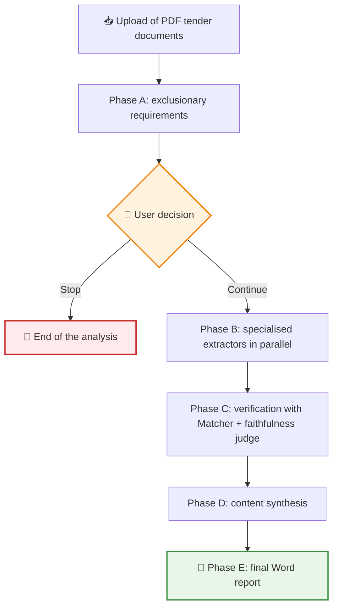
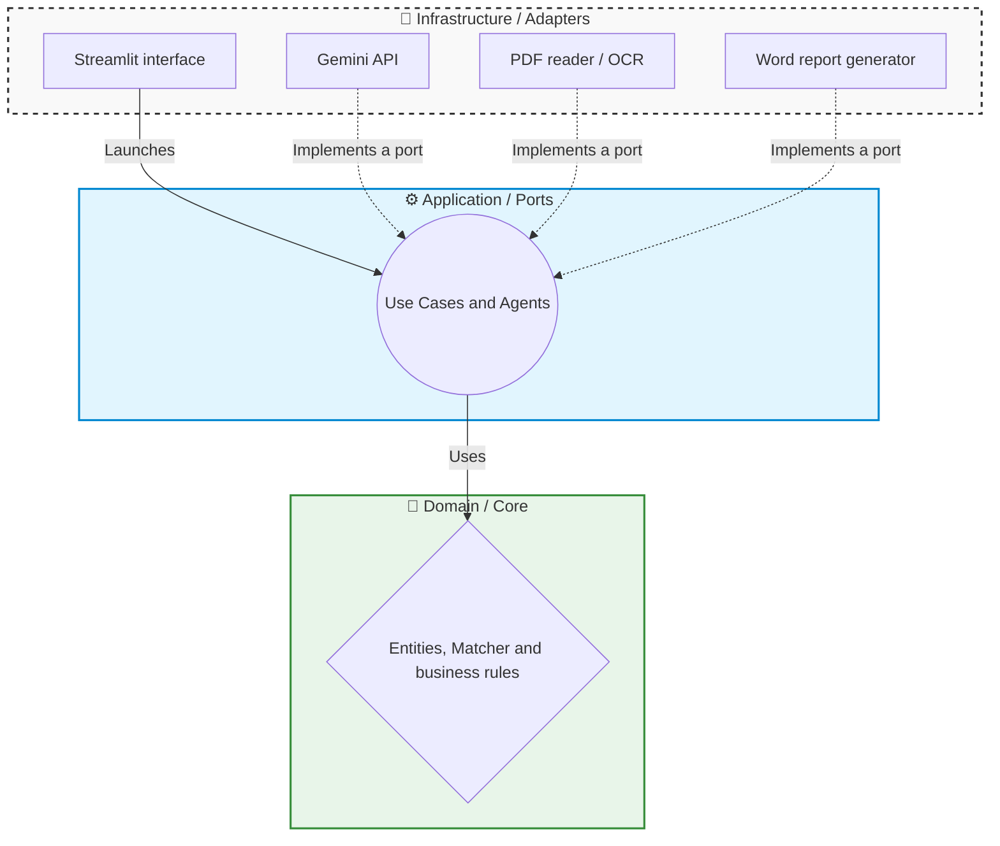

# 🤖 Showcase: AI-Powered Public Tender Analyser

This project is a tool designed to automate the reading and extraction of requirements from public tender documents (such as PCAP or PPT specifications). It uses a team of Artificial Intelligence agents to look for the conditions a company must meet in order to bid for a public contract, and generates a final Word report with the verified results.

> [!NOTE]
> **Confidentiality Notice**
> As this is a project developed for a company, certain internal details, specific prompts and parts of the code are protected by confidentiality. However, in this document I explain in broad terms the main structure and how the application works.

## 🔎 What does the application do?

The application takes documents in PDF format and uses AI models (currently Google Gemini) to find "facts" or eligibility requirements (for example, required certifications such as ISO 27001, technical solvency, data protection regulations, etc.).

One of the biggest challenges when using AI is preventing it from making up information (what is known as "hallucinations"). To solve this, the system has a strict two-level verification mechanism:

- 🎯 The AI is configured to return the **exact verbatim quote** from the document where it found the requirement.
- 🛡️ An internal verification module (**Matcher**) deterministically checks that this text really exists in the pages of the original PDF.
- ⚖️ A second model acts as a **faithfulness judge**: it reviews every claim/quote pair and discards facts that are not genuinely backed by the document.

## 🔄 Phased workflow

The analysis is not done in a single pass, but in chained phases, with a human checkpoint in the middle:

**Phase A** looks only for **exclusionary** requirements (those that would leave the company out of the bidding process straight away). With that summary, the user decides whether it is worth continuing: if the company does not meet one of the eligibility requirements, the process stops there and no more money is spent analysing the rest of the document. This human "gate" was a design decision aimed both at cost control and at making the tool assist the person rather than replace them.

## 🏗️ Project Architecture

I developed this project applying the **Hexagonal Architecture** pattern (also known as Ports and Adapters). This design decision helped me clearly separate the business logic from the external technologies.

The project is divided into three main layers:

1. 🧠 **Domain (`core/domain`)**: this is where the core rules of the project live. For example, the basic entities (Document, Fact) and the pure text verification logic. This layer knows nothing about databases or external APIs.
2. ⚙️ **Application (`core/application`)**: it coordinates the workflows. Here I define the "Ports" (interfaces) that establish how any language model or auditing system we may want to use in the future must behave, and here the agents (extractors, judges, synthesis) that orchestrate each phase also live.
3. 🔌 **Infrastructure (`infrastructure`)**: this is where the "Adapters" live, which are the real technological implementations. For example, the code that makes the requests to the Gemini API, the one that extracts the text from PDFs, the Word report generator or the Streamlit user interface.

## ✨ Technical Highlights

During development, I focused on solving real-world problems that arise when integrating AI models:

*   ✅ **Double validation of results**: instead of blindly trusting the AI's response, every fact goes first through a deterministic check (the Matcher verifies that the quote exists in the PDF) and afterwards through an LLM judge that evaluates whether the claim is faithful to that quote. Only what passes both filters makes it into the report.
*   💰 **Cost Control (Budget Guard)**: AI APIs are billed by usage (tokens). To avoid surprises on the invoice if something goes wrong, I implemented a system that counts the tokens consumed and blocks executions if a safe spending limit (a cap in euros) is exceeded. In addition, before launching the analysis a **cost estimate** is calculated so the user knows what they are about to spend.
*   🔄 **Resilience and Retries**: since it depends on external cloud services, outages or connection errors are common. I applied the **Decorator** pattern to wrap the AI client in independent layers: one retries the requests on temporary failures, another measures the tokens consumed and another watches the budget. Each layer has a single responsibility and they can be combined without touching the original adapter.
*   📄 **Hybrid PDF Reading (OCR)**: if a PDF is a scanned document with no selectable text, the system uses a fallback tool with OCR (Optical Character Recognition using Tesseract) to be able to read the image.
*   📝 **Complete audit trail**: every call to the model is recorded in a structured log (JSONL) together with its token consumption. If a result looks odd or spending spikes, it is possible to reconstruct exactly what happened in each run.
*   ⚡ **Parallel extraction**: the specialised extractors of Phase B run concurrently (asyncio), which considerably reduces the total analysis time of a tender document.

## 🚀 Project Status

The project is a work in progress (WIP). It currently has a **Streamlit web interface** from which the tender documents are uploaded, the progress of each phase is followed in real time and the decision to continue or stop is taken after Phase A. The final result is a **Word report** with the verified requirements. The next development steps are focused on fine-tuning the calibration of the judge agents and on preparing the tool for internal use within the company.

---

**Iván Herrero - AI & Automation Specialist**
