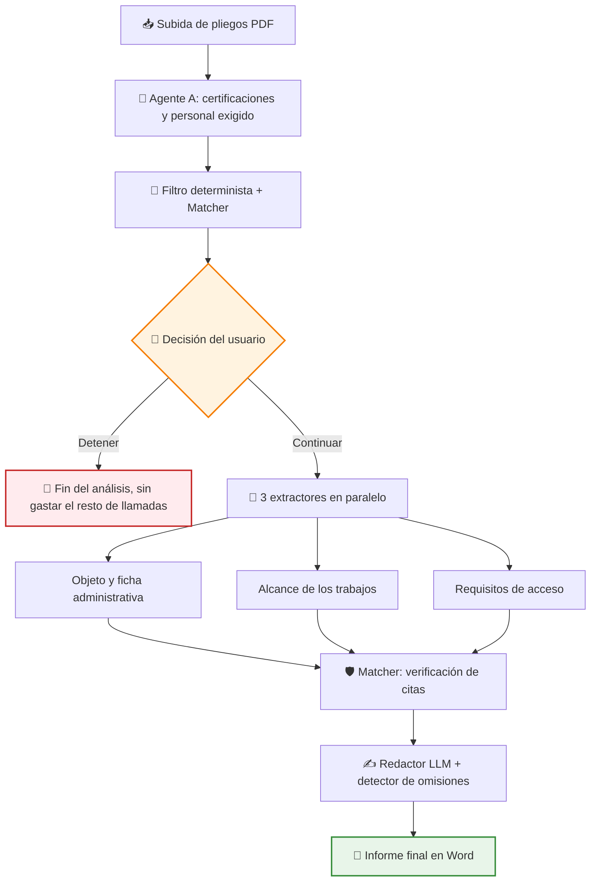
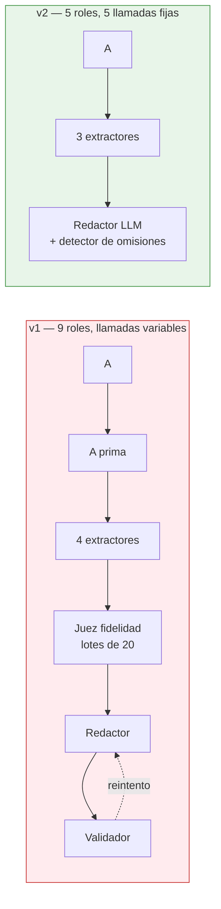
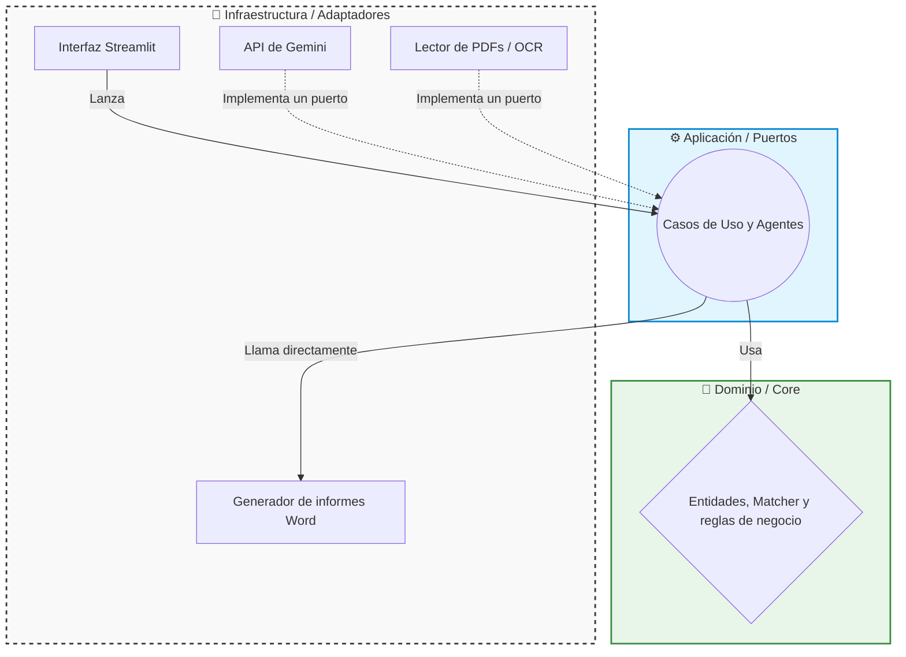

# 🤖 Showcase: Analizador de Licitaciones con IA

Este proyecto es una herramienta diseñada para automatizar la lectura y extracción de requisitos en documentos de licitaciones públicas (como los pliegos PCAP o PPT). Utiliza un equipo de agentes de Inteligencia Artificial para buscar las condiciones que una empresa debe cumplir para poder presentarse a un concurso público, y genera un informe final en Word con los resultados verificados.

> [!NOTE]
> **Aviso de Confidencialidad**
> Como es un proyecto desarrollado para una empresa, ciertos detalles internos, prompts específicos y partes del código están protegidos por confidencialidad. Sin embargo, en este documento explico a grandes rasgos la estructura principal y cómo funciona la aplicación.

## 🔎 ¿Qué hace la aplicación?

La aplicación recibe documentos en formato PDF y utiliza modelos de IA (actualmente Google Gemini) para encontrar "hechos" o requisitos de acceso (por ejemplo, certificaciones exigidas como ISO 27001 o el ENS, perfiles de personal obligatorios, normativas de protección de datos, etc.).

Uno de los mayores retos al usar IA es evitar que se invente información (lo que se conoce como "alucinaciones"). Para solucionarlo, el sistema apoya cada hecho en evidencia comprobable:

- 🎯 La IA está obligada a devolver la **cita textual exacta** del documento donde encontró el requisito, junto con su número de página.
- 🛡️ Un módulo interno de verificación (**Matcher**) comprueba de forma determinista —sin IA y sin coste— que ese texto existe realmente en las páginas del PDF original. Lo que no se encuentra, no llega al informe.
- 👤 Cada hecho del informe final lleva su documento y su página, de modo que la persona que lo lee puede abrir el pliego y comprobarlo en segundos. **La revisión humana es parte del diseño, no un parche.**

## 🔄 Flujo de trabajo

El análisis se hace en dos tramos, con un punto de control humano en medio:

El **agente A** actúa como puerta: busca las certificaciones y normas (ISO, UNE, ENS) —tanto las exigidas para presentarse como las que puntúan o las que el adjudicatario debe cumplir durante la ejecución, incluido el nivel del ENS— y el personal que el pliego obliga a adscribir. Con ese resumen —cada requisito con su cita y su página— el usuario decide si merece la pena continuar. Si para ahí, no se gasta ni una llamada más.

Ese "gate" humano no es un control de calidad del agente: **es una decisión de negocio**. El sistema informa, no opina sobre si presentarse — quien conoce las certificaciones que tiene su empresa es la persona, no el modelo.

## ✂️ Rediseño v2: menos agentes, menos llamadas

La primera versión del sistema tenía **nueve roles de IA**: el agente de exclusión, un "abogado del diablo", cuatro extractores, un juez de fidelidad, un redactor y un validador final. Sobre el papel era una arquitectura defensiva. En la práctica tenía dos problemas.

**Problema 1: la maquinaria más cara no cubría el riesgo más grave.** El juez de fidelidad y el validador comprobaban que lo afirmado tuviera una cita detrás — protegían contra la invención. Pero el riesgo real de esta herramienta no es que invente un requisito: es que **se deje uno fuera**. Y una omisión no genera ninguna afirmación que juzgar, así que esos dos agentes eran ciegos precisamente al fallo que más importa. Además, la verificación de citas ya la hacía el Matcher determinista, gratis.

**Problema 2: el coste crecía con el documento.** El juez de fidelidad procesaba los hechos en lotes de 20, así que un pliego denso disparaba las llamadas. Un caso real del *golden set* generó **74 hechos en un solo extractor**: eso son cuatro llamadas más de juez solo para ese agente.

| | v1 | v2 |
|---|---|---|
| Roles de IA | 9 | **5** (A, 3 extractores, redactor) |
| Llamadas por análisis | ~10 a 18, **según densidad del pliego** | **5, fijas** |
| Generación del Word | Redactor LLM sin control | Redactor LLM + **detector determinista de hechos omitidos** |

> [!IMPORTANT]
> A 15/09/2026 el recorte está aplicado en el código: los cuatro agentes retirados están **borrados del repositorio**, no desconectados. Cómo se genera el informe sigue siendo una decisión abierta (ver *Una decisión revertida*).

Lo importante no es solo que sean menos llamadas: es que ahora son **un número constante**. En v1, analizar un pliego largo costaba más llamadas que uno corto, así que el gasto era imposible de predecir antes de lanzarlo.

### Por qué esto importa tanto: el tier gratuito

El proyecto funciona sobre la **capa gratuita de la API de Gemini**, que limita las peticiones por minuto y por día. Ahí el recurso escaso no es el dinero — es la **cuota de llamadas**. Con 9 roles y un número variable de peticiones, un solo pliego denso podía consumir buena parte del margen diario y dejar la herramienta inutilizable el resto de la jornada.

Bajar a 5 llamadas fijas por análisis cambia la naturaleza del límite: pasa de ser un riesgo impredecible a una cuenta trivial. Y como los 3 extractores corren en paralelo, el análisis completo son **tres rondas de peticiones** (A, extractores, redactor), no cinco secuenciales.

### Lo que se eliminó, y por qué

| Pieza retirada | Motivo |
|---|---|
| Juez de fidelidad y validador (2 agentes LLM) | Protegen contra la invención, que el Matcher determinista ya cubre gratis. No detectan omisiones, que es el riesgo crítico declarado |
| "Abogado del diablo" (busca resquicios legales en un requisito incumplido) | Ese juicio lo hace mejor la persona, que conoce su propia empresa. Pasa a la pantalla de decisión |
| Extractor de SLA/KPI/penalizaciones | Esa información no se necesita en el informe por ahora |

### Una decisión revertida: el render determinista

Al ejecutar el pipeline completo sobre un pliego real, comprobé que el redactor recibía todos los hechos y escribía un informe que dejaba fuera el certificado ENS y las cláusulas de RGPD. Nada en el sistema lo detectaba — los validadores estaban preparados para cazar lo que el modelo *inventa*, no lo que *descarta en silencio*. El plan inicial de v2 fue sustituir al redactor por código.

Al preparar ese cambio apareció la causa real: **el prompt del redactor le ordenaba ignorar las categorías del agente A**. No omitía por criterio propio; obedecía.

Corregido el prompt, el redactor se queda, porque el informe es el producto y la prosa se lee mejor que un listado. La omisión no se da por resuelta: se **mide**. Cada informe calcula sin llamadas qué hechos verificados recibió el redactor y no citó, y los muestra en pantalla. En una corrida real sobre el pliego más denso fueron 67, así que la comparación contra un render determinista sigue abierta y se decidirá con los dos Word delante.

## 🔬 Lo que enseñaron los benchmarks

Diseñé un arnés de *benchmarking* propio para elegir el modelo de cada agente, con *ground truth* sacado de informes reales y comparación por página. Estas son las conclusiones que sacó, y ninguna era obvia de antemano.

> [!NOTE]
> Las lecciones 1 a 7 salen de la primera versión del arnés (agosto y primera mitad de septiembre), medida sobre un *golden set* que después se sustituyó. Siguen explicando decisiones vigentes, pero sus cifras **no son comparables** con las del set actual. Las lecciones 8 a 10 son de la medición del 18/09 sobre el set nuevo.

### 1. No existe un "mejor modelo": existe el mejor modelo *para cada agente*

Es la hipótesis con la que arranqué, y los datos la confirmaron de la forma más contundente posible — **el mismo modelo salió primero en un agente y descartado en otro**:

| Modelo | Extractor B1 (objeto y ficha) | Extractor B4 (requisitos de acceso) |
|---|---|---|
| `gemini-2.5-flash` | **4/4 (100%)** — el mejor | ❌ **Descartado** |
| `gemini-3.6-flash` | 3/4 (75%) | **10/11 (91%)** — el mejor |
| `gemini-3-flash-preview` | 3/4 (75%) | 9/11 (82%) |
| `gemini-3.5-flash-lite` | 3/4 (75%) | 4/11 (36%) |

Fijarse en la última fila también es interesante: el modelo más barato pasa de ser competitivo en una tarea (3/4) a inservible en otra (36%). Elegir un único modelo "bueno" para todo el sistema habría sido la decisión equivocada, tanto por calidad como por coste.

### 2. Fiabilidad y precisión no son lo mismo — y la fiabilidad manda

`gemini-2.5-flash` acertó **6 de 6** en las licitaciones que logró completar en B4. Aun así lo descarté para ese agente. El motivo: no terminaba las llamadas. Es un modelo extremadamente granular —hasta 6× más tokens de salida que sus rivales para el mismo documento— y agotaba el límite de respuesta a mitad, devolviendo un JSON truncado que no se puede parsear. **Un agente que acierta el 100% de las veces que termina, pero solo termina la mitad de las veces, es inutilizable.**

Eso destapó de paso un fallo de configuración real: un pliego del *golden set* necesitaba **12.982 tokens de salida** (74 hechos) frente al límite de 8.192 que compartían todos los extractores. Sin el benchmark, esos hechos se habrían perdido en silencio en producción.

### 3. Cuando varios modelos fallan lo mismo, el problema es tuyo

En B1, tres de cuatro modelos fallaron **exactamente el mismo elemento**. Un fallo compartido no es ruido aleatorio: es una señal de diseño. Al investigarlo resultó que la instrucción del extractor decía "no extraigas datos operativos, eso es de otros agentes" — y eso espantaba contenido legítimo que en muchos pliegos vive bajo epígrafes tipo *"Descripción de los trabajos"*.

No era un problema de modelo, era una **frontera mal trazada entre agentes**. En v2 los extractores se han redefinido siguiendo la estructura real de los documentos en lugar de categorías semánticas inventadas por mí.

### 4. El primer benchmark mide tu *ground truth* tanto como el modelo

Varias plantillas de la Junta de Castilla y León incluyen una ficha-resumen en la página 1 que repite el objeto y el presupuesto antes de desarrollarlos en prosa páginas más adelante. Mi *ground truth* solo apuntaba a la prosa, así que marcaba como fallo a modelos que citaban **correctamente** la página 1.

Es decir: durante un tiempo estuve midiendo mal. Lección que me llevo: los primeros resultados de un banco de pruebas nuevo hay que leerlos como sospechosos del propio banco, no como veredictos sobre lo que mide.

### 5. Un modelo más nuevo no es un modelo mejor

Al probar un modelo de generación posterior sobre el mismo pliego de 66 páginas, devolvió **209 tokens de salida y 1 requisito**, frente a los **2.589 tokens y 8 requisitos** del modelo anterior. Para el agente cuya métrica crítica es no dejarse nada fuera, ser más rápido y más barato no compensa: ahí el criterio de asignación es *recall* casi a cualquier precio.

### 6. Medir antes de arreglar: la hipótesis era falsa

Un extractor emitió 32.754 tokens de salida y se truncó. La sospecha era que duplicaba citas. Un volcado de 421 hechos lo desmintió: solo 2 citas idénticas. La causa real era otra: **95 de 166 hechos eran una lista de leyes despiezada norma a norma**. Al recortarla, el volumen bajó, pero se perdieron certificaciones como el ENS. El criterio de cierre ("acotar no puede bajar el *recall*") no se cumplió, y eso llevó a trasladar las certificaciones al agente A con un filtro determinista.

### 7. Prompt y modelo van acoplados

Con la misma instrucción ("un hecho por bloque de servicio"), `gemini-2.5-flash` emitió 138 hechos en ese extractor y los modelos 3.x entre 6 y 15. Pero los 3.x perdieron presupuesto, duración y obligaciones de seguridad en los otros extractores. Además cuentan **el mismo PDF al doble de tokens de entrada** (~35.300 frente a ~17.500). Con la cuota gratuita, el reparto de modelos también es una cuestión de disponibilidad, no solo de calidad, y un prompt afinado para un modelo hay que volver a medirlo al cambiar de modelo.

### 8. El mejor *ground truth* es el que el revisor ya produce

El *golden set* original eran ficheros de texto transcritos a mano: decían qué había en el pliego, pero no guardaban **qué había tenido que corregir el revisor** en el informe de la IA, que es justo lo que interesa medir. Lo sustituí por los propios informes Word que genera la aplicación, anotados por el revisor con un código de colores:

| Marca | Significado | Efecto en la métrica |
|---|---|---|
| 🔴 Rojo | La IA lo afirmó y es incorrecto | Baja la precisión |
| 🔵 Cian | La IA lo omitió y estaba en el pliego | Baja el *recall* |
| 🟡 Amarillo | Correcto en lo esencial, con un detalle corregido (o en el apartado equivocado) | Calidad, no fallo duro |
| 🟣 Rosa | No estaba en el pliego: la IA no podía saberlo | **Fuera del denominador** |
| Sin marca | Correcto | ✓ |

Un script lee los Word en vivo y deriva de ellos el *ground truth* de cada extractor: **239 entradas en 9 pliegos**, sin transcribir nada. Anotar es marcar excepciones, no confirmar aciertos, así que el set crece con el trabajo que la persona ya hace.

La marca rosa existe por un caso real: un pliego de 65 páginas **no contenía ninguna cifra de importe**. Marcarla como omisión habría penalizado al extractor por algo que no estaba en su entrada. Y el límite conocido queda escrito: el denominador es *lo que un humano vio*; un hecho que ni la IA ni el revisor echaron en falta no aparece en ninguna parte.

### 9. Una cota superior sirve para descartar, no para dar una cifra

Medir "¿el modelo sacó este hecho?" exige juzgar si una paráfrasis equivale al original. El arnés hace primero lo barato: cuenta como *candidato* cualquier hecho en la página exacta. Eso es una **cota superior**, y el veredicto humano la pone en su sitio. Sobre las 27 omisiones 🔵 del extractor de alcance que todos los modelos pudieron medir:

| Modelo | Cota superior | Veredicto humano (hecho + página correctos) |
|---|---|---|
| `gemini-3.6-flash` | 24/27 | **18/27 (67%)** |
| `gemini-3-flash-preview` | 14/27 | **7/27 (26%)** |

Tres conclusiones: la cota infla parecido en los dos (6-7 entradas), así que ordena bien pero no mide; la ventaja de `3.6-flash` **sobrevive al veredicto** (más del doble); y `gemini-3.1-flash-lite` (43% de cota en el *recall* total) queda descartado sin necesidad de revisarlo a mano. Además, **8 de las 27 omisiones no las recupera ningún modelo**: ahí el problema no es el modelo, es el prompt, que pedía "un hecho por bloque de servicio" y aplastaba en uno solo las listas de tareas.

Un detalle que me parece tan importante como las cifras: en la primera pasada marqué como fallo un acierto de `3.6-flash` ("Plataforma de gemelo digital y simulación avanzada" frente a "Gemelo digital y simulación avanzada"). **La revisión humana también se equivoca**, y por eso el veredicto se guarda en una hoja revisable, no solo como número.

### 10. "El modelo nuevo no funciona" era un valor por defecto

Durante días, cualquier modelo distinto de `gemini-2.5-flash` hacía fallar la ejecución. La causa no era el modelo: el adaptador pedía un presupuesto de razonamiento mínimo de 1 token a los modelos sin configuración propia, cada modelo lo subía a su mínimo interno, y **el razonamiento se comía el techo de salida del agente**. Darles a esos modelos un presupuesto explícito de 0 bastó para que funcionaran, y fue lo que desbloqueó el benchmark comparativo. Lo pendiente está anotado: comprobar en el contador de tokens de razonamiento que está de verdad apagado, y no solo que ya no estorba.

## 🏗️ Arquitectura del Proyecto

He desarrollado este proyecto aplicando el patrón de **Arquitectura Hexagonal** (también conocida como Puertos y Adaptadores). Esta decisión de diseño me ha servido para separar claramente la lógica del negocio de las tecnologías externas.

El proyecto se divide en tres capas principales:

1. 🧠 **Dominio (`core/domain`)**: Aquí están las reglas centrales del proyecto. Por ejemplo, las entidades básicas (Documento, Hecho) y la lógica pura de verificación de textos. Esta capa no sabe nada de bases de datos ni de APIs externas.
2. ⚙️ **Aplicación (`core/application`)**: Coordina los flujos de trabajo. Aquí defino los "Puertos" (interfaces) que establecen cómo debe comportarse cualquier modelo de lenguaje o sistema de auditoría que queramos usar en el futuro, y también viven los agentes que orquestan cada fase.
3. 🔌 **Infraestructura (`infrastructure`)**: Aquí viven los "Adaptadores", que son las implementaciones tecnológicas reales. Por ejemplo, el código que hace las peticiones a la API de Gemini, el que extrae el texto de los PDFs, el generador de informes Word o la interfaz de usuario en Streamlit.

Esta separación fue lo que hizo posible el recorte de v2: **retirar cuatro agentes no obligó a tocar ni el lector de PDFs, ni el adaptador de Gemini, ni la interfaz**. Cambió el caso de uso que los orquesta, y poco más.

> [!NOTE]
> **Deuda conocida (15/09/2026).** La separación no es perfecta todavía: el Matcher del dominio lee sus umbrales directamente de la configuración de infraestructura, y el generador de Word se invoca desde el caso de uso sin pasar por un puerto. Las dos roturas están localizadas y anotadas en la hoja de ruta.

## ✨ Características Técnicas Destacadas

Durante el desarrollo, me he enfocado en resolver problemas del mundo real que surgen al integrar modelos de IA:

*   ✅ **Verificación determinista de citas**: Cada hecho pasa por un Matcher que comprueba, contra el texto real del PDF, que la cita existe en la página declarada (con tolerancia difusa para absorber el ruido del OCR). Es una defensa que **no cuesta ni una llamada** — y precisamente por eso pudo sustituir a un agente LLM entero.
*   🔄 **Resiliencia y Reintentos**: Al depender de servicios externos en la nube, es común que haya cortes o errores de conexión. He aplicado el patrón **Decorator** para envolver el cliente de la IA en capas independientes: una reintenta las peticiones ante fallos temporales y otra mide los tokens consumidos. Cada capa tiene una única responsabilidad y se pueden combinar sin tocar el adaptador original.
*   📄 **Lectura Híbrida de PDFs (OCR)**: Si un PDF es un documento escaneado y no tiene texto seleccionable, el sistema usa una herramienta de respaldo con OCR (Tesseract) para poder leerlo. Muchos pliegos reales son escaneos sin capa de texto.
*   📝 **Auditoría completa**: Cada llamada al modelo queda registrada en un log estructurado (JSONL) con su consumo de tokens, su latencia y por qué terminó. Ese registro es lo que permitió diagnosticar los fallos descritos en la sección de benchmarks: sin él, "el informe salió incompleto" habría sido un callejón sin salida.
*   ⚡ **Extracción en paralelo**: Los extractores se ejecutan de forma concurrente (`asyncio`), así que tras la decisión del usuario quedan solo **dos rondas** de espera (extractores y redactor) y no una llamada detrás de otra.
*   🧮 **Dos capas: el prompt busca, el código decide**: el agente A extrae de forma permisiva y una expresión regular sobre la *cita* (no sobre la paráfrasis del modelo) exige un esquema acreditable (ENS, ISO, UNE, CCN-STIC...). Sobre 4 pliegos: 17 de 21 páginas esperadas y **0 falsos descartes de 12**. Los requisitos de acceso no se filtran: ahí manda el *recall*.
*   ❔ **"No hay" no es "no lo sé"**: si un extractor falla, el Word ya no dice "sin datos en el pliego", sino que avisa de que la ausencia no está comprobada. Afirmar de más es peor que callar.
*   🩹 **Recuperación de respuestas truncadas**: un JSON cortado a mitad ya no supone perder todos los hechos del agente.
*   📏 **Límites medidos, no supuestos**: el tope de tamaño por documento estaba en 32 MB, una cota puesta a ojo al escribir el validador. El primer pliego grande de uso real pesaba **56 MB**. Al subirlo apareció el matiz que de verdad importa: en un PDF escaneado lo caro es el OCR, y el OCR escala con **páginas**, no con megabytes (un escaneo a 600 dpi pesa el triple que uno a 300 y cuesta lo mismo de leer). La guardia efectiva del sistema no es el peso del fichero, es el límite de páginas.
*   🧪 **Verificación por gates**: Antes de dar por bueno cualquier modelo nuevo se ejecuta un chequeo rápido que descarta en segundos los que no tienen cuota o no responden, sin gastar una corrida completa de benchmark.

## 🚀 Estado del Proyecto

El proyecto es un trabajo en progreso (WIP) avanzado. La versión v2 —el rediseño descrito arriba— está en curso siguiendo una hoja de ruta por fases, cada una con su propio criterio de cierre: **no se avanza a la siguiente fase hasta que los tests de lo modificado están en verde y la aplicación completa un análisis real de principio a fin.**

Cerradas **cuatro de las ocho fases** (del 26 al 31 de agosto de 2026): pipeline recortado, módulos y esquemas huérfanos borrados, y capa de control de presupuesto retirada. El 18/09 se desbloqueó la fase de benchmark por agente: el arnés ya mide sobre el *ground truth* nuevo y hay una primera línea base con veredicto humano. Siguen en curso la reestructuración del informe y la pantalla de decisión. El segundo proveedor de IA está **aparcado** (16/09): hoy no hay acceso a otro proveedor que Google, y no bloquea el cierre de la v2. A 18/09/2026 la suite ha pasado de **94 a 212 tests en verde**, el pipeline —la pieza más modificada— de **0 tests a 25**, y `mypy` analiza 83 ficheros.

Una auditoría del 09/09 encontró algo incómodo: **la documentación daba por hechos arreglos que el código no tenía**, y el gate de `mypy` llevaba días en verde sin llegar a analizar nada (un error de configuración cortaba el análisis en el primer fichero). Desde entonces cada afirmación de estado se contrasta con el código antes de darla por buena, este documento incluido.

Ese criterio ha demostrado su valor de inmediato. Al ejecutar el primer análisis real tras el recorte aparecieron **seis defectos** que ningún test detectaba y que llevaban días en el código: citas que abarcaban varias páginas y por eso resultaban imposibles de verificar, límites de respuesta que truncaban extractores enteros, y un bloqueo de la aplicación al cerrarla desde la terminal. Ninguno lo había introducido el rediseño; simplemente nadie había ejecutado la aplicación entera con la atención puesta en lo que *faltaba* en el resultado.

Actualmente la herramienta cuenta con una **interfaz web en Streamlit** desde la que se suben los pliegos, se audita el progreso en tiempo real y se toma la decisión de continuar o parar tras la fase A. El resultado final es un **informe en Word** con los requisitos verificados, cada uno con su documento y su página.

### Próximos pasos

1. **Completar el reparto de modelos**: medir los otros dos extractores con los modelos finalistas, repetir corridas (una sola no separa el modelo de la variabilidad) y decidir el modelo de los extractores con los tres a la vez. Si `3.6-flash` confirma su ventaja, el redactor tendrá que pasar a otro modelo: con la cuota gratuita, dos fases sobre el mismo modelo compiten por las mismas peticiones.
2. **Benchmark del agente A**: el *ground truth* nuevo cubre los extractores, pero el agente más crítico es la puerta, porque un requisito que él no vea no lo recupera nadie después. Un matiz medido: solo 3 de los 9 pliegos del set mencionan normativa con densidad suficiente para medir esa dimensión con fiabilidad.
3. **Cerrar el informe**: revisar un Word real contra un informe modelo y decidir, con datos, entre redactor LLM y render determinista. El redactor se truncó el 15/09 al recibir 17.469 tokens de hechos: antes de comparar calidad, tiene que terminar.
4. **Pantalla de decisión completa**: mostrar lo que el Matcher y el filtro descartan en la fase A, y añadir una red de seguridad que avise si una página nombra un esquema acreditable que ningún hecho cubre. Esa red no depende de que el modelo acierte.
5. **Segundo proveedor de IA (aparcado)**: es la razón de que exista la capa de Puertos — poder asignar a cada agente el modelo que mejor rinde en su tarea, sea de la casa que sea. Se retomará cuando haya acceso a otro proveedor; el benchmark entre modelos de Gemini no depende de ello.

---

**Iván Herrero - AI & Automation Specialist**
