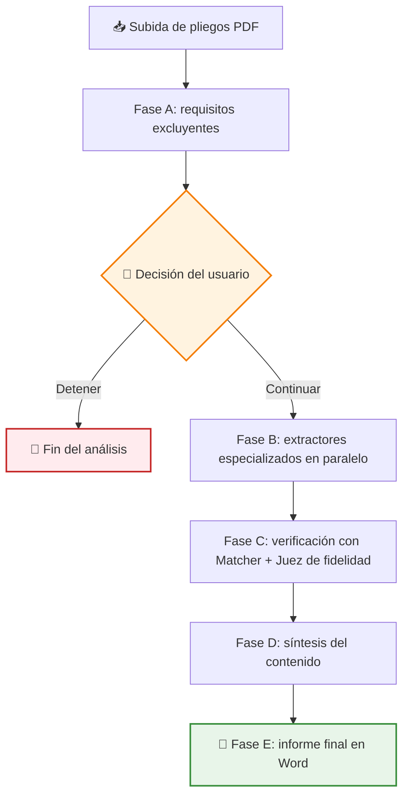
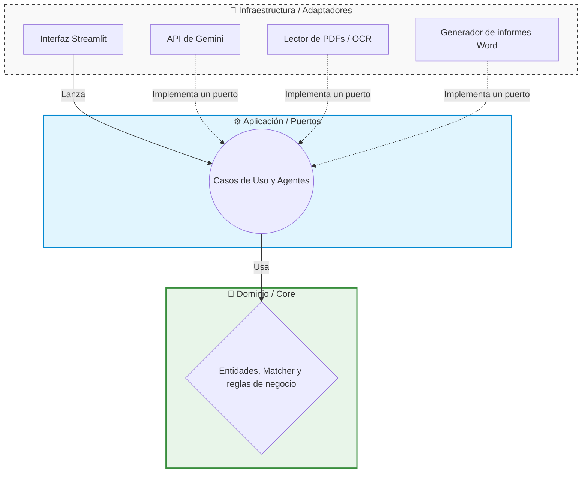

# 🤖 Showcase: Analizador de Licitaciones con IA

Este proyecto es una herramienta diseñada para automatizar la lectura y extracción de requisitos en documentos de licitaciones públicas (como los pliegos PCAP o PPT). Utiliza un equipo de agentes de Inteligencia Artificial para buscar las condiciones que una empresa debe cumplir para poder presentarse a un concurso público, y genera un informe final en Word con los resultados verificados.

> [!NOTE]
> **Aviso de Confidencialidad**
> Como es un proyecto desarrollado para una empresa, ciertos detalles internos, prompts específicos y partes del código están protegidos por confidencialidad. Sin embargo, en este documento explico a grandes rasgos la estructura principal y cómo funciona la aplicación.

## 🔎 ¿Qué hace la aplicación?

La aplicación recibe documentos en formato PDF y utiliza modelos de IA (actualmente Google Gemini) para encontrar "hechos" o requisitos de acceso (por ejemplo, certificaciones exigidas como ISO 27001, solvencia técnica, normativas de protección de datos, etc.).

Uno de los mayores retos al usar IA es evitar que se invente información (lo que se conoce como "alucinaciones"). Para solucionarlo, el sistema tiene un mecanismo estricto de verificación en dos niveles:

- 🎯 La IA está configurada para devolver la **cita textual exacta** del documento donde encontró el requisito.
- 🛡️ Un módulo interno de verificación (**Matcher**) comprueba de forma determinista que ese texto existe realmente en las páginas del PDF original.
- ⚖️ Un segundo modelo actúa como **juez de fidelidad**: revisa cada par afirmación/cita y descarta los hechos que no estén realmente respaldados por el documento.

## 🔄 Flujo de trabajo por fases

El análisis no se hace de una sola pasada, sino en fases encadenadas, con un punto de control humano en medio:

La **Fase A** busca únicamente los requisitos **excluyentes** (los que dejarían fuera del concurso a la empresa directamente). Con ese resumen, el usuario decide si merece la pena continuar: si la empresa no cumple algún requisito de acceso, el proceso se detiene ahí y no se gasta más dinero en analizar el resto del documento. Este "gate" humano fue una decisión de diseño pensada tanto para el control de costes como para que la herramienta asista a la persona, no la sustituya.

## 🏗️ Arquitectura del Proyecto

He desarrollado este proyecto aplicando el patrón de **Arquitectura Hexagonal** (también conocida como Puertos y Adaptadores). Esta decisión de diseño me ha servido para separar claramente la lógica del negocio de las tecnologías externas.

El proyecto se divide en tres capas principales:

1. 🧠 **Dominio (`core/domain`)**: Aquí están las reglas centrales del proyecto. Por ejemplo, las entidades básicas (Documento, Hecho) y la lógica pura de verificación de textos. Esta capa no sabe nada de bases de datos ni de APIs externas.
2. ⚙️ **Aplicación (`core/application`)**: Coordina los flujos de trabajo. Aquí defino los "Puertos" (interfaces) que establecen cómo debe comportarse cualquier modelo de lenguaje o sistema de auditoría que queramos usar en el futuro, y también viven los agentes (extractores, jueces, síntesis) que orquestan cada fase.
3. 🔌 **Infraestructura (`infrastructure`)**: Aquí viven los "Adaptadores", que son las implementaciones tecnológicas reales. Por ejemplo, el código que hace las peticiones a la API de Gemini, el que extrae el texto de los PDFs, el generador de informes Word o la interfaz de usuario en Streamlit.

## ✨ Características Técnicas Destacadas

Durante el desarrollo, me he enfocado en resolver problemas del mundo real que surgen al integrar modelos de IA:

*   ✅ **Doble validación de resultados**: En lugar de confiar ciegamente en la respuesta de la IA, cada hecho pasa primero por una comprobación determinista (el Matcher verifica que la cita existe en el PDF) y después por un juez LLM que evalúa si la afirmación es fiel a esa cita. Solo lo que supera ambos filtros llega al informe.
*   💰 **Control de Costes (Budget Guard)**: Las APIs de IA se cobran por uso (tokens). Para evitar sorpresas en la factura si algo falla, he implementado un sistema que cuenta los tokens consumidos y bloquea las ejecuciones si se supera un límite de gasto seguro (tope en euros). Además, antes de lanzar el análisis se calcula una **estimación del coste** para que el usuario sepa lo que va a gastar.
*   🔄 **Resiliencia y Reintentos**: Al depender de servicios externos en la nube, es común que haya cortes o errores de conexión. He aplicado el patrón **Decorator** para envolver el cliente de la IA en capas independientes: una reintenta las peticiones ante fallos temporales, otra mide los tokens consumidos y otra vigila el presupuesto. Cada capa tiene una única responsabilidad y se pueden combinar sin tocar el adaptador original.
*   📄 **Lectura Híbrida de PDFs (OCR)**: Si un PDF es un documento escaneado y no tiene texto seleccionable, el sistema usa una herramienta de respaldo con OCR (Reconocimiento Óptico de Caracteres usando Tesseract) para poder leer la imagen.
*   📝 **Auditoría completa**: Cada llamada al modelo queda registrada en un log estructurado (JSONL) con su consumo de tokens. Si un resultado es raro o el gasto se dispara, se puede reconstruir exactamente qué pasó en cada ejecución.
*   ⚡ **Extracción en paralelo**: Los extractores especializados de la Fase B se ejecutan de forma concurrente (asyncio), lo que reduce bastante el tiempo total de análisis de un pliego.

## 🚀 Estado del Proyecto

El proyecto es un trabajo en progreso (WIP). Actualmente cuenta con una **interfaz web en Streamlit** desde la que se suben los pliegos, se sigue el progreso de cada fase en tiempo real y se toma la decisión de continuar o parar tras la Fase A. El resultado final es un **informe en Word** con los requisitos verificados. Los siguientes pasos del desarrollo están enfocados en afinar la calibración de los agentes jueces y en preparar la herramienta para su uso interno en la empresa.

---

**Iván Herrero - AI & Automation Specialist**
